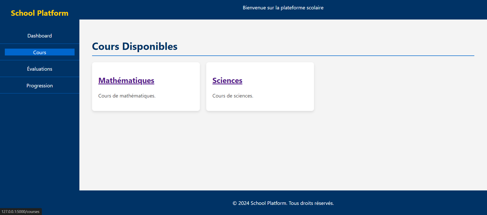

# School-Platform
 ---
## Overview
This is a simple web application designed to improve learning experiences in schools. It allows teachers to create courses and quizzes, track student progress, and provide personalized teaching based on student performance. Students can access course materials and quizzes online, making it easier for them to learn and review topics at their own pace.

---

## App Features
1. **Teacher Tools**: Teachers can create courses and quizzes to assess student understanding.
2. **Student Access**: Students have easy access to course materials and quizzes, which helps reinforce their learning.
3. **Performance Tracking**: Teachers can monitor and analyze student performance, enabling them to tailor their teaching to individual student needs.

---

## The app UI

###  Dashboard page

###  Courses page

